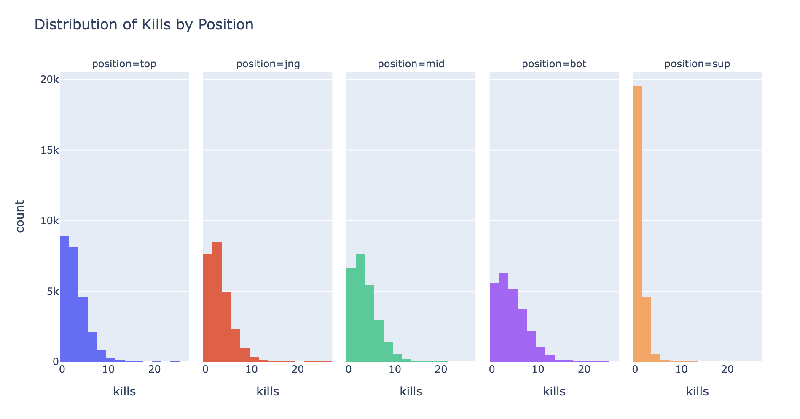
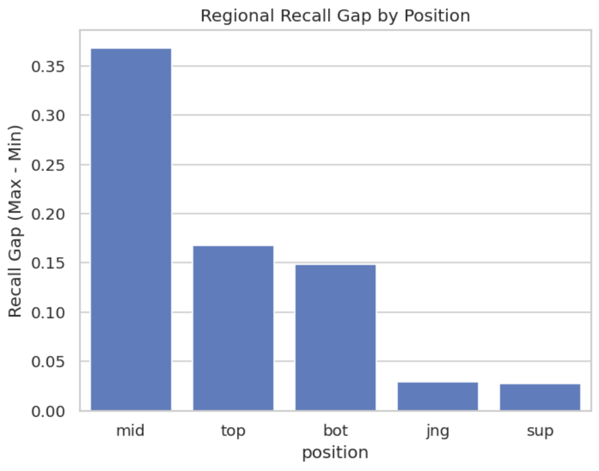
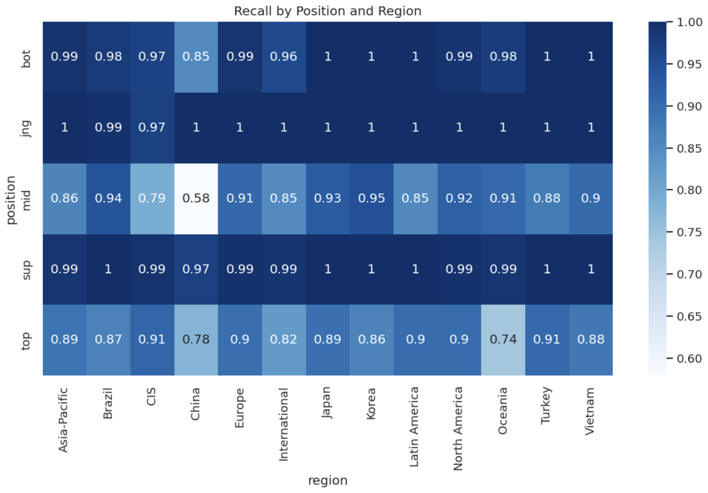

# Classifying Player Positions Using Post‑Game Statistics in League of Legends

by: Cameron Hensley, Ritesh Saxena, Angela Watson, Rita Zaarour

## Introduction

This project uses a **League of Legends match dataset at the player level**, where each row represents **one player’s performance in a single game**. The dataset captures in‑game statistics such as combat performance, resource generation, damage output, gold income, and objective participation. Together, these metrics describe how a player contributes to their team during a match.

League of Legends is a **role‑based game**, where each position (Top, Jungle, Mid, Bottom, Support) serves a distinct strategic purpose. While players select a role before the match begins, their **in‑game behavior and statistics** may tell a more nuanced story about the position they actually played.

#### **Our Question:** 
> _Can we classify a player’s position (Top, Jungle, Mid, Bottom, Support) using only their in‑game statistics?_

This question has clear **machine learning relevance**, as it represents a real‑world **multiclass classification problem** using structured numerical data. It allows us to demonstrate **feature engineering, classification techniques, and model evaluation** using a popular game with rich and interpretable data.

For readers of this website, this project illustrates how **raw gameplay data can be transformed into meaningful insights** about player behavior and team dynamics.

#### **Dataset Summary**
> 124,150 rows and 165 columns

### Relevant Coulmns and Their Descriptions.

| Column Name | Description |
|------------|------------|
| `position` | The role played by the user in the match (Top, Jungle, Mid, Bottom, Support). This is the **target variable**. |
| `side` | The side the player or team was on: Blue or Red. |
| `kills` | Number of enemy champions the player personally killed during the match; higher for carry roles. |
| `assists` | Number of enemy champion kills the player assisted with; typically higher for Supports and Junglers. |
| `deaths` | Number of times the player died; frontline roles often have higher death counts. |
| `doublekills` | Number of double kills by this player. |
| `triplekills` | Number of triple kills by this player. |
| `quadrakills` | Number of quadra kills by this player. |
| `pentakills` | Number of penta kills by this player. |
| `firstbloodkill` | Whether this player got the first blood kill. |
| `firstbloodassist` | Whether this player assisted on the first blood kill. |
| `firstbloodvictim` | Whether this player was the first blood victim. |
| `damagetochampions` |Total damage dealt to enemy champions; reflects offensive contribution by role. |
| `dpm` | Damage to champions per minute. |
| `damageshare` | Percentage of the team’s total champion damage contributed by the player. |
| `damagetakenperminute` | Damage received from enemy champions per minute. |
| `damagemitigatedperminute` | Damage mitigated (blocked/reduced) per minute. |
| `damagetotowers` | Total damage dealt to towers by this player. |
| `wardsplaced` | Total wards placed by this player. |
| `wpm`| Wards placed per minute|
| `wardskilled` | Total enemy wards destroyed by this player.| 
| `wcpm` |	Wards cleared per minute. |
| `controlwardsbought` | Number of control wards purchased; strongly associated with the Support role. |
| `visionscore` | Composite metric measuring vision control through wards placed, cleared, and maintained. |
| `vspm` | Vision score per minute. |
| `totalgold` | Total gold earned by this player over the entire game. |
| `earnedgold` | Gold earned excluding starting gold. |
| `earned gpm` | Earned gold per minute. |
| `earnedgoldshare` | This player's share of the team's total earned gold. |
| `goldspent` | Total gold spent on items by this player. |
| `total cs` | Total number of minions and monsters killed; distinguishes farming roles from Supports. |
| `minionkills` | Total lane minions killed. |
| `monsterkills` | Total jungle monsters killed. |
| `monsterkillsownjungle` | Number of jungle monsters killed in the player’s own jungle; primary indicator of the Jungle role. |
| `monsterkillsenemyjungle` | Number of jungle monsters killed in the player’s enemy jungle; primary indicator of the Jungle role. |
| `cspm` | Creep score per minute; normalizes farming behavior across different game lengths. |
| `goldat10` | Total gold earned by the player at 10 minutes; captures early‑game economic differences by role. |
| `xpat10` | Total XP at 10 minutes. |
| `csat10` | Total creep score at 10 minutes; indicates early lane or jungle farming patterns. |
| `opp_goldat10` | Lane opponent's total gold earned by the player at 10 minutes |
| `opp_xpat10` | Lane opponent's total XP at 10 minutes. |
| `opp_ csat10` | Lane opponent's total creep score at 10 minutes; indicates early lane or jungle farming patterns. |
| `killsat10` | Player's kills at 10 minutes. |
| `assistsat10` | Player's assists at 10 minutes. |
| `deathsat10` | Player's deaths at 10 minutes. |
| `opp_killsat10` | Lane opponent's kills at 10 minutes. |
| `opp_assistsat10` | Lane opponent's assists at 10 minutes. |
| `opp_deathsat10` | Lane opponent's deaths at 10 minutes. |
| `goldat15` | Total gold earned by the player at 15 minutes. |
| `xpat15` | Total XP at 15 minutes. |
| `csat15` | Total creep score at 15 minutes. |
| `opp_goldat15` | Lane opponent's total gold earned by the player at 15 minutes |
| `opp_xpat15` | Lane opponent's total XP at 15 minutes. |
| `opp_ csat15` | Lane opponent's total creep score at 15 minutes; indicates early lane or jungle farming patterns. |
| `killsat15` | Player's kills at 15 minutes. |
| `assistsat15` | Player's assists at 15 minutes. |
| `deathsat15` | Player's deaths at 15 minutes. |
| `opp_killsat15` | Lane opponent's kills at 15 minutes. |
| `opp_assistsat15` | Lane opponent's assists at 15 minutes. |
| `opp_deathsat15` | Lane opponent's deaths at 15 minutes. |
| `goldat20` | Total gold earned by the player at 20 minutes. |
| `xpat20` | Total XP at 20 minutes. |
| `csat20` | Total creep score at 20 minutes. |
| `opp_goldat20` | Lane opponent's total gold earned by the player at 20 minutes |
| `opp_xpat20` | Lane opponent's total XP at 20 minutes. |
| `opp_ csat20` | Lane opponent's total creep score at 20 minutes; indicates early lane or jungle farming patterns. |
| `killsat20` | Player's kills at 20 minutes. |
| `assistsat20` | Player's assists at 20 minutes. |
| `deathsat20` | Player's deaths at 20 minutes. |
| `opp_killsat20` | Lane opponent's kills at 20 minutes. |
| `opp_assistsat20` | Lane opponent's assists at 20 minutes. |
| `opp_deathsat20` | Lane opponent's deaths at 20 minutes. |
| `goldat25` | Total gold earned by the player at 25 minutes. |
| `xpat25` | Total XP at 25 minutes. |
| `csat25` | Total creep score at 25 minutes. |
| `opp_goldat25` | Lane opponent's total gold earned by the player at 25 minutes |
| `opp_xpat25` | Lane opponent's total XP at 25 minutes. |
| `opp_ csat25` | Lane opponent's total creep score at 25 minutes; indicates early lane or jungle farming patterns. |
| `killsat25` | Player's kills at 25 minutes. |
| `assistsat25` | Player's assists at 25 minutes. |
| `deathsat25` | Player's deaths at 25 minutes. |
| `opp_killsat25` | Lane opponent's kills at 25 minutes. |
| `opp_assistsat25` | Lane opponent's assists at 25 minutes. |
| `opp_deathsat25` | Lane opponent's deaths at 25 minutes. |

---

## Data Cleaning and EDA

The distribution of kills per player in League of Legends is right-skewed, with most players recording relatively low kill counts and a small number of high-performing players producing a long right tail of extreme values. The distributions are similar by position, with the exception of the Support position which has a much higher frequency of low kill values. The differences in kills by position indicates that this might be a good feature for our classification problem.

The plot demonstrates a strong regional imbalance in League of Legends esports, with Korea and China achieving dominant win rates well above 50%, while most minor regions fall significantly below the global average when competing internationally.

---

## Assessment of Missingness
#### State whether you believe there is a column in your dataset that is NMAR. Explain your reasoning and any additional data you might want to obtain that could explain the missingness (thereby making it MAR). Make sure to explicitly use the term “NMAR.”

### Yes — the url column is NMAR.

The url column (missing ~87% of rows) contains links to match VODs. While its missingness correlates with league (some leagues have urls more than others), this correlation alone does not make it MAR. The missingness is ultimately driven by an unobserved variable — whether a league or tournament organizer has a VOD publication policy — which is not captured anywhere in the dataset. The absence of a url is informative about the value itself: a match without a url is one that was never recorded or published, and that fact is tied to something inherent about the match (its league's media infrastructure), not just to observed columns. This makes url NMAR.

To make this MAR, additional data that could explain the missingness includes:

- League media policy data — a column indicating whether each league officially publishes VODs (yes/no). If missingness is fully explained by this flag, it becomes MAR.
- Tournament tier/region — a structured classification of leagues by region and competitive tier (e.g., major vs. minor region), which may proxy for VOD availability.
- Broadcast platform — knowing whether a match was streamed on Twitch, YouTube, or a regional platform (or not at all) would directly explain why no url exists.

If any of these variables were added to the dataset and fully accounted for the missingness pattern in url, the mechanism would shift from NMAR to MAR — because the missingness would then be explainable by observed data rather than the unrecorded value itself.  

##### Present and interpret the results of your missingness permutation tests with respect to your data and question. Embed a plotly plot related to your missingness exploration; ideas include:
• The distribution of column 
 when column    is missing and the distribution of column    when column 
 is not missing, as was done in Lecture 8.
• The empirical distribution of the test statistic used in one of your permutation tests, along with the observed statistic.

WIP -- ritesh

---

## Hypothesis Testing
#### **Question of Interest**
> **Which competitive region has the highest win rate against teams outside their region?**

In the professional **League of Legends** ecosystem, regional identity is a source of pride and often cited by fans and players alike as a real driver of competitive success on the world stage. This analysis seeks to move beyond anecdotal "power rankings" by determining if a team's **home region** is a statistically significant predictor of their win rate in cross-region matches.

By isolating **535 international clashes** from the 2022 season, we test the null hypothesis that all regions possess an **equal probability of victory**. Establishing whether these performance gaps are statistically **"real"** allows us to identify the true hierarchy of global play and determine if the **"gap"** between the East and West (or maybe even between powerhouse regions like China and Korea) is supported by the data.

---

#### **Hypothesis Framework**

* **Null Hypothesis ($H_0$):** The probability of winning a cross-region match is independent of a team's home region.
* **Alternative Hypothesis ($H_a$):** The probability of winning a cross-region match depends on a team's home region.
* **Test-Statistic:** **Chi-Square Statistic ($\chi^2$)**
    * *Rationale:* We are testing the association between two **categorical variables** (Home Region and Match Result).

---

## Framing a Prediction Problem
We are solving a **multiclass classification** task where we predict a player's position (top, jng, mid, bot, sup) based on their post-game statistics. We chose **position** as our target variable because each position has a relatively different gaming style that is reflected in their post-game stats.

We evaluate our model using **accuracy, precision, recall, and F1-score** together. _Accuracy_ gives us an overall measure of correctness and is appropriate here since the five positions are perfectly balanced in the dataset. We also report _precision, recall, and F1-score_ on a per-role basis. This allows us to identify which specific positions the model struggles to classify and where it performs well, giving us a more complete picture of model performance than any single metric alone.

---

## Baseline Model
Our baseline model is a **Logistic Regression classifier** implemented in a single sklearn Pipeline. Missing values were filled with the column mean before training. We used 85 quantitative features and 1 nominal feature ['side'] out of 165 features total. We did not use any ordinal features. A StandardScaler was applied to the quantitative features and the nominal feature was OneHotEncoded. 

The model achieved **93.52% accuracy** on the test set. Per-role, jungle and support were classified nearly perfectly (F1 ≈ 1.00) due to their highly distinct stat profiles, while bot was also classified strongly (F1 ≈ 0.96). Mid and top were the hardest to distinguish (F1 ≈ 0.86) as they share similar statistics. We believe this is a strong baseline given the natural statistical separation between roles, though there is still room for improvement in distinguishing mid from top. 

---

## Final Model
For our final model we switched to a **Random Forest Classifier** and engineered two new features on top of the existing 85 quantitative and 1 nominal features:

---

## Fairness Analysis

#### **Fairness Question**
> Does the model perform equally well for players from different regions?

### Performance Metrics by Region

The table below displays the Accuracy, Macro Recall and Macro Precision by Region, giving us an indication of how well our model performs on the whole at a Region level.

| Region           | Accuracy | Macro Recall | Macro Precision |
|------------------|----------|--------------|-----------------|
| China            | 0.834281 | 0.835914     | 0.833810        |
| International    | 0.922314 | 0.924671     | 0.924221        |
| Oceania          | 0.922907 | 0.922845     | 0.928986        |
| CIS              | 0.925272 | 0.926887     | 0.925752        |
| Asia-Pacific     | 0.943631 | 0.945978     | 0.945328        |
| Latin America    | 0.950761 | 0.950258     | 0.950831        |
| Brazil           | 0.955255 | 0.955981     | 0.957214        |
| Europe           | 0.957059 | 0.957202     | 0.957389        |
| Turkey           | 0.957659 | 0.956691     | 0.956607        |
| Vietnam          | 0.957831 | 0.957303     | 0.957523        |
| North America    | 0.961654 | 0.960980     | 0.960985        |
| Korea            | 0.963050 | 0.962087     | 0.963492        |
| Japan            | 0.964876 | 0.964290     | 0.964149        |

Accuracy gap: 0.1306
Macro Recall gap: 0.1284

The Accuracy gap of 0.1306 and Macro Recall gap of 0.1284 indicate that the model performs differently depending on region.

This is further demonstrated at a position level in the following graph, where we can see the recall gap is particularly large for the Mid position.

The heatmap below shows low recall for the Mid position in the region of China.

To validate that the different in model performance by region is statistically significant, we tested two sets of hypotheses.

* **Null Hypothesis ($H_0$):** The Accuracy of our model is consistent across regions.
* **Alternative Hypothesis ($H_a$):** The accuracy of our model is inconsistent for at least one region.
* **Test-Statistic:** **Chi-Square Statistic ($\chi^2$)**

Chi-square statistic: 765.7712905863178
p-value: 3.603585165703335e-156

* **Null Hypothesis ($H_0$):** The Accuracy of our model is consistent across regions for the Mid position in particular.
* **Alternative Hypothesis ($H_a$):** The accuracy of our model is inconsistent at predicting the Mid position for at least one region.
* **Test-Statistic:** **Chi-Square Statistic ($\chi^2$)**

Mid Recall Chi-square: 523.3821469340835
Mid Recall p-value: 2.3287323370630366e-104

Both p-values are well below a threshold of 0.05, so we reject both null hypotheses.

#### Fairness Conclusion
Although overall regional performance disparities exist, the fairness issue is highly concentrated in the Mid role, which exhibits a recall disparity of 36.8 percentage points across regions. In contrast, Jungle and Support are relatively stable, suggesting that the model’s fairness issues are role-specific rather than universally distributed. The differences in overall recall and recall for the Mid position are statistically significant.

---
